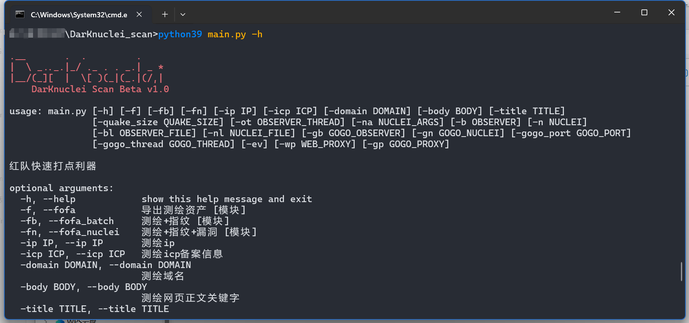
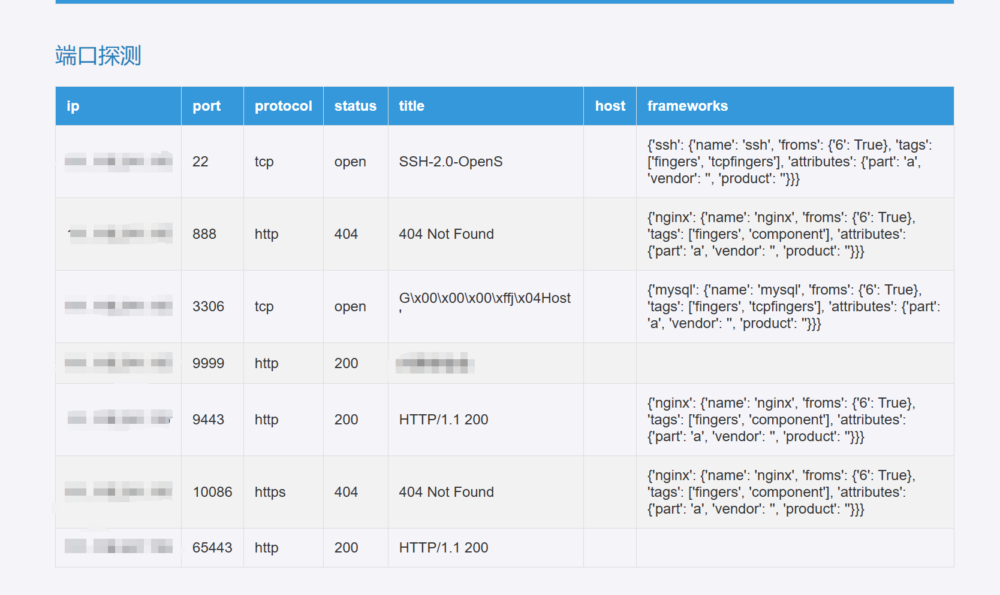
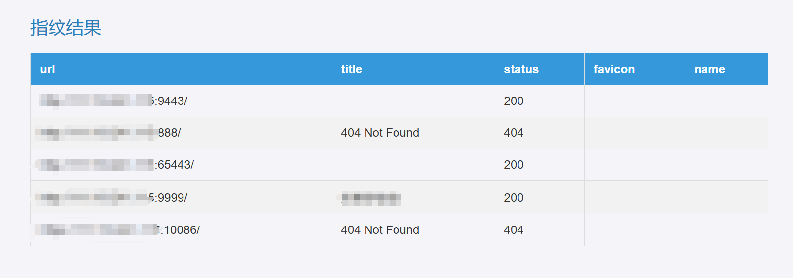
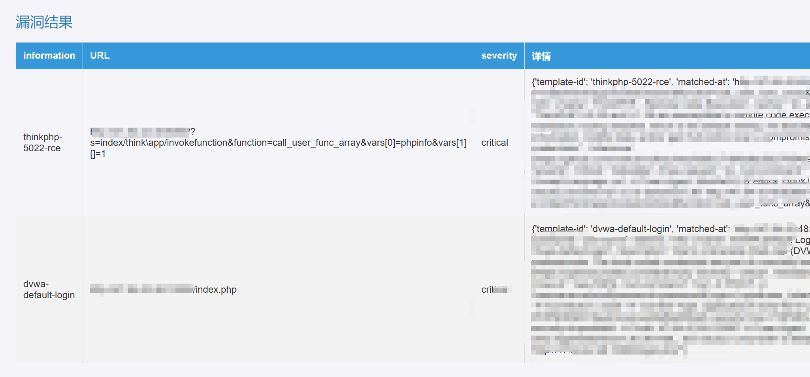

#  🚀DarKnuclei Scan Beta v1.0

## 🔺目标

1. 对目标的测绘资产快速打点
2. 一堆目标中快速识别打点



#### TODO：

- [ ] 搜索引擎js文件路径，以及ico图片hash搜索【手动导入，输入ico图标地址在线搜索】。
- [ ] 导出格式Excel报表。
- [ ] 对vshell，CS，MSF等c2工具进行指纹识别。
- [ ] 对蜜罐识别进行识别调研，以及安全设备指纹。
- [ ] 针对其它资产测绘平台。
- [ ] 通过测绘得到IP资产，对IP资产进行端口扫描指纹识别。
- [ ] 钉钉企业微信漏洞扫描结果通知。

### 设计：


## 🔰功能

1. 收集目标测绘资产。

   1. fofa，quake [域名，ip，tcp，host，SSL(通用名称,证书持有者的组织,证书序列号)，title，body，一年前后资产]。
   2. fofa导出资产为最大条数，quake为1000。
   3. 只需配置好fofa以及quake key，调用测绘的时候默认检测key，存在则调用。

2. 指纹识别之后在搜索对应漏洞扫描，借助`observer_ward`+`gogo`+`nuclei`。
3. 本地批量识别资产。

   ```
   http://baidu.com  			   识别：http://baidu.com
   http://baidu.com/xxxx/xxx.asp 识别：http://baidu.com/xxxx/xxx.asp
   http://192.168.3.1:7788       识别：http://192.168.3.1:7788  192.168.3.1
   baidu.com					      识别：http://baidu.com  https://baidu.com
   192.168.3.1					      识别：192.168.3.1	
   192.168.3.1:8080			      识别：192.168.3.1
   ```

4. 导出txt以及html报告


## 📢 使用

#### 环境配置：

1. 如果需要进行漏洞扫描需要讲`nuclei`加入环境变量。
2. 如需使用测绘功能请修改`config.ini`添加key。
3. python版本：`python3.9`。
4. 如果是mac或linux请下载对于的执行程序在plugin目录，并配置`config.ini`。

   1. observer_ward
   2. nuclei
   3. gogo

   


### 常用命令：

`python3 main.py -h`

project目录：扫描结果保存目录

#### 1、测绘资产

```shell
python39 main.py -f -domain baidu.com -ip 192.168.1.2 -icp xxxxxx -title 百度  -body 百度
```

- 查看域名=`baidu.com`  or  IP=192.168.1.2 or icp=xxxxxx or  title=百度 or  body=百度。
- 只需配置好fofa以及quake key，调用测绘的时候默认检测key，存在则调用。

#### 2、测绘资产+指纹识别

```shell
python39 main.py -fb -domain baidu.com -ip 192.168.1.2 -icp xxxxxx -title 百度  -body 百度
```

- 查看域名=`baidu.com`  or  IP=192.168.1.2 or icp=xxxxxx or  title=百度 or  body=百度。
- 将查询得到的资产进行使用进行`指纹识别`。

#### 3、测绘资产+指纹识别+漏洞扫描

```shell
python39 main.py -fn -domain baidu.com -ip 192.168.1.2 -icp xxxxxx -title 百度  -body 百度  -quake_size 1000 -ot 30
```

- 查看域名=`baidu.com`  or  IP=192.168.1.2 or icp=xxxxxx or  title=百度 or  body=百度。
- quake导出资产1000，同时指纹识别线程为30。
- 将查询得到的资产进行使用`指纹识别+漏洞扫描。`

#### 4、单个目标指纹扫描

```shell
python39 main.py  -b http://baidu.com -wp http://127.0.0.1:4432
```

- 对单个目标进行指纹扫描。
- 设置web扫描代理为：`http://127.0.0.1:4432。`

#### 5、单个目标指纹扫描+漏洞扫描

```shell
python39 main.py  -n http://baidu.com -wp http://127.0.0.1:4432
```

- 对单个目标进行指纹扫描+漏洞扫。

- 设置web扫描代理为：`http://127.0.0.1:4432。`


#### 6、批量目标指纹扫描

```shell
python39 main.py  -bl url.txt -wp http://127.0.0.1:4432
```

- 批量目标进行指纹扫描。
- 设置web扫描代理为：`http://127.0.0.1:4432。`
- url.txt：一行一个资产，其中需要有：http:// or https://。

#### 7、批量目标指纹扫描+漏洞扫描

```shell
python39 main.py  -nl http://baidu.com -wp http://127.0.0.1:4432
```

- 批量目标进行指纹扫描+漏洞扫。

- 设置web扫描代理为：`http://127.0.0.1:4432。`

- url.txt：一行一个资产，其中需要有：http:// or https://。

#### 8、gogo+指纹

```shell
python39 main.py  -gb url.txt  -wp http://127.0.0.1:4432 -gp socks5://127.0.0.1:4412 
```

- 进行资产识别处理，批量目标进行指纹扫描+漏洞扫。

  - 本地批量识别资产【url.txt】

    ```
    http://baidu.com  			   识别：http://baidu.com
    http://baidu.com/xxxx/xxx.asp 识别：http://baidu.com/xxxx/xxx.asp
    http://192.168.3.1:7788       识别：http://192.168.3.1:7788  192.168.3.1
    baidu.com					      识别：http://baidu.com  https://baidu.com
    192.168.3.1					      识别：192.168.3.1	
    192.168.3.1:8080			      识别：192.168.3.1
    识别为：ip进行gogo探针-》将http网站与识别到为http或https进行指纹
    ```

- 设置web扫描代理为：`http://127.0.0.1:4432`。

- 设置gogo扫描代理为：`socks5://127.0.0.1:4412 `。

#### 9、gogo+指纹+漏洞

```shell
python39 main.py  -gn url.txt -ev -wp http://127.0.0.1:4432 -gp socks5://127.0.0.1:4412  -gogo_port top2
```

- 进行资产识别处理，批量目标进行指纹扫描+漏洞扫。

  - 本地批量识别资产【url.txt】

    ```
    http://baidu.com  			   识别：http://baidu.com
    http://baidu.com/xxxx/xxx.asp 识别：http://baidu.com/xxxx/xxx.asp
    http://192.168.3.1:7788       识别：http://192.168.3.1:7788  192.168.3.1
    baidu.com					      识别：http://baidu.com  https://baidu.com
    192.168.3.1					      识别：192.168.3.1	
    192.168.3.1:8080			      识别：192.168.3.1
    识别为：ip进行gogo探针-》将http网站与识别到为http或https进行指纹
    ```

- `-ev`gogo自带指纹识别+漏洞探针

- 设置web扫描代理为：`http://127.0.0.1:4432`

- 设置gogo扫描代理为：`socks5://127.0.0.1:4412 `

- `-gogo_port`设置扫描端口为常见端口。


## 演示







## 交流群


## 感谢以下开源项目
https://github.com/emo-crab/observer_ward

https://github.com/chainreactors/gogo

https://github.com/projectdiscovery/nuclei
